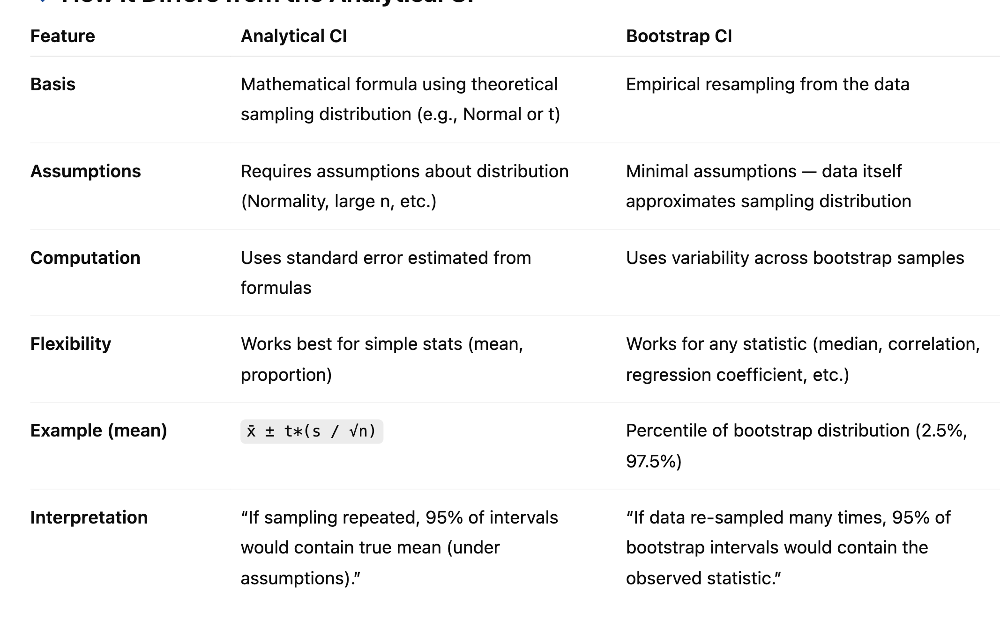

# 🧠 IDS 702 Midterm Comprehensive Study Guide

---

## 📍 Unit 1: Statistics Fundamentals

---

### 1️⃣ Population vs. Sample
- **Population**: the entire group of interest (e.g., all Duke students).  
- **Sample**: a subset used to estimate population parameters.  
- **Goal**: draw *inferences* about the population using the sample.  
- Sampling introduces **sampling variability** — estimates differ across samples.

---

### 2️⃣ Inference vs. Prediction
| Type | Goal | Example |
|------|------|----------|
| **Inference** | Understand relationships / test hypotheses | Does smoking affect heart disease risk? |
| **Prediction** | Forecast outcomes | Predict next year’s CO₂ emissions |

---

### 3️⃣ Probability Concepts
- **Random Variable (RV):** numerical outcome of a random process.  
- **PMF/PDF:** Probability Mass (discrete) or Density (continuous) function.  
- **Expected Value (E[X]):** long-run mean of RV.  
- **Variance (Var[X]):** spread around the mean.  
- **Joint Probability:** P(A and B)  
- **Conditional Probability:** P(A | B) = P(A and B) / P(B)  
- **Mutually Exclusive:** if A and B cannot occur together, then P(A and B)=0.

---

### 4️⃣ Common Distributions
- **Binomial:** number of successes in *n* independent Bernoulli trials.  
  Parameters → n (trials), p (probability of success).  
- **Normal:** continuous, symmetric “bell curve,” defined by mean μ and variance σ².  
- For large n, Binomial ≈ Normal with μ = np, σ² = np(1−p).

### 📊 Summary Table

| Distribution | Type | Parameters | Support (Range) | Expected Value (E[X]) | Variance (Var[X]) | Typical Use Case |
|---------------|-------|-------------|------------------|------------------------|-------------------|------------------|
| **Bernoulli** | Discrete | p ∈ [0,1] | x ∈ {0,1} | p | p(1 − p) | Single binary outcome (success/failure) |
| **Binomial** | Discrete | n (trials), p (success prob) | x ∈ {0,1,…,n} | np | np(1 − p) | # of successes in n independent trials |
| **Geometric** | Discrete | p ∈ (0,1) | x ∈ {1,2,3,…} | 1/p | (1 − p)/p² | # of trials until first success |
| **Poisson** | Discrete | λ > 0 | x ∈ {0,1,2,…} | λ | λ | Count of events in fixed time/space |
| **Uniform (Discrete)** | Discrete | k equally likely values | x ∈ {1,…,k} | (k + 1)/2 | (k² − 1)/12 | Equal likelihood categorical outcomes |
| **Uniform (Continuous)** | Continuous | a, b (bounds) | x ∈ [a,b] | (a + b)/2 | (b − a)² / 12 | Random real number in interval [a,b] |
| **Normal (Gaussian)** | Continuous | μ (mean), σ² (variance) | x ∈ ℝ | μ | σ² | Many natural phenomena; CLT limit |
| **Exponential** | Continuous | λ > 0 | x ≥ 0 | 1/λ | 1/λ² | Time between Poisson events |
| **Gamma** | Continuous | α (shape), β (rate) | x ≥ 0 | α/β | α/β² | Sum of exponential variables |
| **Beta** | Continuous | α > 0, β > 0 | x ∈ [0,1] | α/(α + β) | (αβ)/[(α + β)²(α + β + 1)] | Probabilities constrained between 0 and 1 |
| **Chi-Square (χ²)** | Continuous | k (degrees of freedom) | x ≥ 0 | k | 2k | Variance estimates, hypothesis tests |
| **t (Student’s t)** | Continuous | ν (degrees of freedom) | x ∈ ℝ | 0 | ν/(ν − 2), ν>2 | Mean estimates with small samples |
| **F** | Continuous | d₁, d₂ (degrees of freedom) | x ≥ 0 | d₂/(d₂ − 2) (if d₂>2) | *Var depends on df* | Comparing variances, ANOVA, regression F-tests |

---

---

### 5️⃣ Sampling Distributions & Central Limit Theorem
- **Sampling Distribution:** distribution of a statistic (e.g., sample mean) over many samples.  
- **CLT:** for large n, the sample mean is approximately normal:  
  `X̄ ~ Normal(μ, σ²/n)`  
- **Standard deviation** = spread of data; **Standard error (SE)** = spread of statistic (∝ 1/√n).

---

### 6️⃣ Maximum Likelihood Estimation (MLE)
1. Write likelihood L(θ)=P(data | θ)  
2. Take log → log-likelihood  
3. Differentiate w.r.t θ, set = 0  
4. Solve for θ̂ (the MLE)

**Idea:** choose parameters that make observed data *most likely*.  
MLEs are consistent, unbiased (as n→∞), and efficient.

---

### 7️⃣ Confidence Intervals (CI)
- **Interpretation:** Repeating sampling many times, about 95 % of intervals contain the true parameter.  
- **Width increases** when:
  - Variability ↑  
  - Confidence level ↑  
  - Sample size ↓  
- **Analytical CI:** uses formulas (e.g., `x̄ ± z * s/√n`)  
- **Bootstrap CI:** obtained via resampling.



---

### 8️⃣ Hypothesis Testing
1. Set up H₀ (null) and Hₐ (alternative).  
2. Compute test statistic (t, z, F, χ²).  
3. Compute p-value = Pr(data or more extreme | H₀).  
4. Reject H₀ if p < α (usually 0.05).  

## 📍 Inference and Hypothesis Testing Overview

Statistical inference helps us draw conclusions about populations using sample data.  
Depending on what we know (e.g., population variance, distributional assumptions, or sample design), we use **different inference methods**.

---

### 🔹 1️⃣ Z-Test vs. T-Test

Both the **z-test** and **t-test** are used to compare means or test hypotheses about population parameters.  
They differ mainly in what is **known** and **assumed** about the population variance (σ²) and sample size.

| Feature | **Z-Test** | **T-Test** |
|----------|-------------|------------|
| **Purpose** | Compare means (large samples or known σ) | Compare means (small samples, σ unknown) |
| **Population SD (σ)** | Known | Unknown (estimated from sample as s) |
| **Test Statistic** | `z = (x̄ − μ₀) / (σ / √n)` | `t = (x̄ − μ₀) / (s / √n)` |
| **Distribution Used** | Standard Normal (Z ~ N(0,1)) | Student’s t with (n−1) df |
| **Sample Size** | Large (n ≥ 30) | Small or moderate (n < 30) |
| **Assumptions** | Data ~ Normal or large n (by CLT) | Data ~ Normal or nearly Normal |
| **Shape of Sampling Dist.** | Fixed (does not depend on n) | Heavier tails (accounts for more uncertainty) |
| **As n increases** | Z always same | T → Z (they converge) |

**When to use each:**
- ✅ **Z-test** → population SD known or sample very large.  
- ✅ **T-test** → population SD unknown (use sample SD); works for small or moderate n.

**Example Scenarios:**
| Scenario | Use | Reason |
|-----------|-----|--------|
| Testing average SAT score with known σ = 100 | Z-test | σ known |
| Comparing mean GPA of 25 students (σ unknown) | T-test | σ estimated from sample |
| Comparing average income between two independent groups | Two-sample T-test | σ unknown |
| Comparing mean score before vs after intervention (same students) | Paired T-test | σ unknown, dependent samples |
| Testing proportion of defective parts in a large batch | Z-test for proportions | large n, known binomial SE formula |

---

### 🔹 2️⃣ Parametric vs. Simulation-Based Inference

There are two broad approaches to statistical inference — **parametric** and **simulation-based** — that differ in how they model uncertainty.

| Feature | **Parametric Inference** | **Simulation-Based Inference** |
|----------|--------------------------|--------------------------------|
| **Basis** | Theoretical probability distributions (e.g., Normal, t, χ², F) | Data-driven resampling (no distribution assumptions) |
| **Examples** | t-test, z-test, ANOVA, regression inference | Bootstrap CIs, permutation (randomization) tests |
| **Assumptions** | Known or assumed sampling distribution | Minimal assumptions; rely on the data itself |
| **Computation** | Analytical formulas (uses standard errors) | Computational — simulate or resample repeatedly |
| **When to Use** | When population model and assumptions are reasonable | When sample size small, distribution unknown, or statistic complex |
| **Output** | Theoretical p-values, confidence intervals | Empirical p-values or bootstrap confidence intervals |

**Intuition:**  
- **Parametric inference** = theoretical; relies on math formulas and distribution assumptions.  
- **Simulation-based inference** = empirical; approximates the sampling distribution by resampling from the observed data.  

**Examples:**
- **t-test:** parametric method using the t-distribution.  
- **Permutation test:** shuffle group labels under H₀ and recompute statistic many times.  
- **Bootstrap CI:** resample (with replacement) to estimate variability of the statistic.

---

### 🔹 3️⃣ Paired vs. Independent Samples

A **two-sample test** compares means or medians between two groups.  
Which test you use depends on whether the samples are **independent** or **paired (dependent)**.

| Situation | **Relationship Between Samples** | **Appropriate Test** | **Example** |
|------------|----------------------------------|----------------------|--------------|
| **Independent Samples** | Observations in one group are completely unrelated to those in the other | Independent Two-Sample T-Test (or Welch’s T-Test if unequal variances) | Compare average GPA of students in two different classes |
| **Dependent / Paired Samples** | Same individuals measured twice, or matched pairs (twins, before-after) | Paired T-Test (based on differences within pairs) | Compare blood pressure before vs after medication for same patients |
| **Nonparametric Alternative (small n / non-normal)** | May use Wilcoxon Rank-Sum (independent) or Wilcoxon Signed-Rank (paired) | Nonparametric Test | Compare median scores for skewed data |

**Key Concepts:**
- **Independent test:** between-subject design → differences across groups.  
- **Paired test:** within-subject design → differences within the same individuals.  
- Pairing reduces variability because each subject serves as their own control.

---

### 🧠 Quick Conceptual Summary

| Concept | Definition | Example / Key Idea |
|----------|-------------|--------------------|
| **Z-Test** | Used when σ known or large n | Compare sample mean to population mean (known σ) |
| **T-Test** | Used when σ unknown | Compare means with estimated variance |
| **Parametric Inference** | Based on theoretical distributions | t-test, ANOVA, regression F-test |
| **Simulation-Based Inference** | Uses data resampling instead of assumptions | Permutation or bootstrap tests |
| **Paired Test** | Same individuals measured twice | Before–after, matched pairs |
| **Independent Test** | Two unrelated groups | Two-sample comparison |

---

---

## 📍 Unit 2: Linear Regression

---

### 1️⃣ Simple and Multiple Linear Regression
**Model:**  
`yᵢ = β₀ + β₁xᵢ₁ + β₂xᵢ₂ + … + βₚxᵢₚ + εᵢ`

**Goal:** estimate coefficients β that minimize  
`RSS = Σ(yᵢ − ŷᵢ)²`

**Interpretation:**  
- β̂ⱼ = expected change in Y for a one-unit change in Xⱼ, holding others constant.  
- p-value tests if βⱼ significantly differs from 0.  
- CI gives a range of plausible slopes.

---

### 2️⃣ Matrix Notation
`Y = Xβ + ε`  
- Y: n×1 vector of responses  
- X: n×p design matrix (first column = 1s for intercept)  
- β: p×1 vector of coefficients  
- ε: n×1 vector of errors  

**OLS solution:** `β̂ = (XᵀX)⁻¹XᵀY`

---

### 3️⃣ Categorical Predictors
- Represent each level (except one) with dummy variables (0/1).  
- Reference = baseline category.  
- For K levels → K − 1 dummies.  
- Avoid K dummies → perfect multicollinearity.  

**Interpretation:** each coefficient = difference from reference group mean (Y).

---

### 4️⃣ Interaction Terms
Model:  
`Y = β₀ + β₁X₁ + β₂X₂ + β₃(X₁·X₂) + ε`

- The term β₃(X₁·X₂) allows the effect of X₁ to depend on X₂.  
- If β₃ ≠ 0 → interaction significant.  
- Example: effect of dosage on anxiety differs by age group.  
- Use when theory or EDA suggest different slopes by groups.

---

### 5️⃣ Model Assessment
**Coefficient of Determination (R²):**  
`R² = 1 − (RSS / TSS)` → proportion of variance in Y explained by model.

**Adjusted R²:**  
`R²_adj = 1 − (1 − R²) * ((n − 1)/(n − p − 1))`  
Penalizes extra predictors.

**Interpretation:**  
- High R² means more variance explained but not necessarily better fit.  
- Use Adjusted R² for comparing models with different numbers of predictors.

---

### 6️⃣ Regression Assumptions

| Assumption | Diagnostic Plot | Expected | Violation / Fix |
|-------------|----------------|-----------|----------------|
| **Linearity** | Residuals vs Fitted | Random scatter | Add polynomial terms or transform X |
| **Independence** | Residuals vs Index | No trend | Account for design or use mixed models |
| **Normality** | Q-Q plot | Points ≈ 45° line | Transform Y or use robust methods |
| **Equal Variance** | Residuals vs Fitted | Constant spread | Transform Y or weighted LS |

Violating assumptions affects inference (p-values, CIs) more than prediction.

---

### 7️⃣ F-Test (Overall Model)
Tests if model explains any variation in Y.

- **Null:** β₁ = β₂ = … = βₚ = 0  
- **Statistic:** `F = (SSR/p) / (SSE/(n − p − 1))`  
- **Decision:** large F → reject H₀ → at least one predictor significant.

---

### 8️⃣ Nested F-Test (Partial F-Test)
Compares two models:

- Reduced model ⊂ Full model  
- Tests if added predictors significantly improve fit.

**Formula:**  
`F = ((RSS_R − RSS_F)/(p_F − p_R)) / (RSS_F/(n − p_F))`

**Interpretation:**  
Reject H₀ if F large → extra predictors help.

**Example (R):**
```r
anova(reduced_model, full_model)
```

---

### 9️⃣ Influential Points and Diagnostics

#### a. Leverage
- **Definition:** Measures how far a point’s predictor values are from the average of all predictors.  
- **Formula (conceptually):**  
  `hᵢᵢ = xᵢᵀ (XᵀX)⁻¹ xᵢ`  
- **Interpretation:**  
  - High leverage → point is far out in X-space.  
  - These points have the *potential* to influence the regression line, even if their residual is small.  
  - The average leverage = (p + 1)/n, where p = number of predictors.  
- **Guideline:**  
  - hᵢᵢ > 2×average → moderately high leverage  
  - hᵢᵢ > 3×average → very high leverage  

---

#### b. Residuals vs Leverage Plot
- **Purpose:** identify points that combine *high leverage* (far in X-space) and *large residuals* (far in Y).  
- **Axes:**  
  - x-axis → leverage  
  - y-axis → studentized (standardized) residuals  
- **Interpretation:**  
  - Points near the center: typical observations.  
  - Points far right → high leverage.  
  - Points far up/down → large residuals (Y-outliers).  
  - Points far right *and* outside the Cook’s-distance contours → **influential**.  

---

#### c. Cook’s Distance
- **Definition:** Quantifies how much the entire fitted model would change if an observation were removed.  
- **Approximate formula:**  
  `Dᵢ = (eᵢ² / (p·MSE)) * (hᵢᵢ / (1 − hᵢᵢ)²)`  
- **Interpretation:**  
  - Dᵢ ≈ 0 → no influence  
  - Dᵢ > 0.5 → potentially influential  
  - Dᵢ > 1 → highly influential  
- **What to do:**  
  - Verify data entry.  
  - Fit the model with and without the observation — if coefficients change greatly, document or justify exclusion.  

---

#### d. Variance Inflation Factor (VIF)
- **Definition:** Measures how much a coefficient’s variance is inflated due to collinearity.  
- **Formula:**  
  `VIFⱼ = 1 / (1 − Rⱼ²)`  
  where Rⱼ² = R² from regressing predictor Xⱼ on all other X’s.  
- **Guidelines:**  
  - VIF ≈ 1 → no correlation  
  - VIF > 5 → moderate multicollinearity  
  - VIF > 10 → serious multicollinearity  
- **Fixes:**  
  - Remove redundant predictors.  
  - Combine correlated features.  
  - Use ridge regression or PCA if all predictors are important.  

---

### 🔟 Multicollinearity

- **Definition:** Two or more predictors are highly linearly related.  
- **Why it matters:** makes coefficients unstable and inflates their standard errors.  

**Consequences**
- Coefficient signs may flip unexpectedly.  
- Large SE → insignificant p-values even for important variables.  
- Difficult to isolate the individual effect of predictors.  

**Detection**
- High pairwise correlations (|r| > 0.9).  
- High VIFs (see above).  

**Solutions**
- Drop or combine correlated variables.  
- Standardize predictors to improve interpretability.  
- Apply regularization (ridge / lasso).  
- In some cases, accept collinearity if predictors are theoretically essential.  

---

### 📊 Diagnostic Plot Summary

| Plot | What It Checks | Expected Pattern | Violation Indicates |
|------|----------------|------------------|----------------------|
| **Residuals vs Fitted** | Linearity + Equal Variance | Random scatter around 0 | Curved pattern → nonlinearity; Funnel → heteroscedasticity |
| **Q–Q Plot** | Normality of residuals | Points ≈ 45° line | Skewed or heavy tails → non-normal errors |
| **Scale–Location** | Homoscedasticity | Horizontal band | Funnel → non-constant variance |
| **Residuals vs Leverage** | Influence / Outliers | Most within Cook’s D < 1 | Outliers or high leverage points |

---

### 🧠 Concept and Test Relationships

| Concept | Purpose | Formula / Key Idea |
|----------|----------|--------------------|
| **t-Test** | Tests a single coefficient | `t = β̂ / SE(β̂)` |
| **F-Test (overall)** | Tests if *any* predictor matters | `F = MSR / MSE` |
| **Nested F-Test** | Tests if new predictors improve model | `F = ((RSS_R − RSS_F)/(p_F − p_R)) / (RSS_F/(n − p_F))` |
| **Leverage** | Measures distance in X-space | `hᵢᵢ` |
| **Cook’s Distance** | Measures influence | `Dᵢ` |
| **VIF** | Detects multicollinearity | `1 / (1 − R²)` |

---

### 🧾 Practical Exam Tips

**Focus on interpretation rather than memorization**
- Understand what each test or plot *tells you*.  
- Be able to read regression output:  
  - Which coefficients are significant?  
  - What is the practical meaning of β̂ⱼ?  
  - Are assumptions violated (based on residual plots)?  

**Key ideas to recall**
- **CLT:** sampling distributions become approximately normal.  
- **OLS:** minimizes RSS → best linear unbiased estimates (BLUE).  
- **F-ratio:** compares explained vs. unexplained variance.  
- **Nested F-test:** compares two models directly.  

**Quick thresholds**
- p < 0.05 → statistically significant.  
- Dᵢ > 1 → potentially influential.  
- VIF > 5 → collinearity concern.  

**Strategy for short-answer questions**
1. Identify model type (SLR / MLR).  
2. Recall what the coefficient or statistic represents.  
3. State direction (+/–) and magnitude of effect.  
4. Comment on assumption checks (plots).  

**Remember:**  
- Interpret regression *in context* (e.g., units, variables).  
- A large R² doesn’t mean the model is valid → check residual diagnostics.  
- High leverage ≠ automatically bad — only problematic if residuals are large too.  

---

### 🧭 Final Summary — Top Exam Takeaways

1. **Understand the 4 regression assumptions** (linearity, independence, normality, homoscedasticity).  
2. **OLS minimizes squared residuals** to estimate β’s.  
3. **t-tests** check individual predictors; **F-tests** check groups.  
4. **Nested F-tests** compare reduced vs full models.  
5. **R² vs Adjusted R²:** adjusted penalizes extra predictors.  
6. **Leverage + Cook’s Distance:** detect influence.  
7. **VIF:** detect multicollinearity.  
8. **Confidence Intervals:** interpretation = “if repeated many times, 95 % of CIs would contain β.”  
9. **p-values:** probability of data (or more extreme) given H₀ true.  
10. **Always explain in plain language** — what does the coefficient or diagnostic mean in the study’s context?  

---


